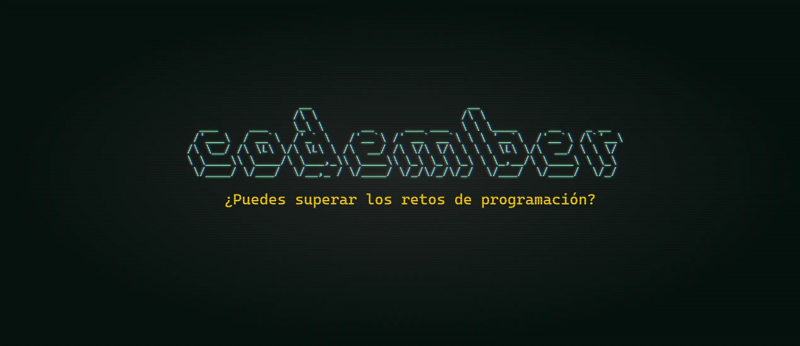

# [codember](https://codember.dev)

Resolution of challenges that I encountered from the challenge [codember](https://codember.dev/) created by [@midudev](https://github.com/midudev/) for community.
The programming challenges that are carried out in the month of November come out every week with challenges, but in this repository for personal reasons we will only dedicate ourselves to solving them.

# 2023

## Challenges Table

|                                        Challenge                                         |            Solutions             |
| :--------------------------------------------------------------------------------------: | :------------------------------: |
|                                           #01                                            | [JS](2023/challenge01/index.js)  | 
|                                                                                          | [TS](2023/challenge01/index.ts)  |
|                                           #02                                            | [JS](2023/challenge02/index.js)  |
|                                                                                          | [TS](2023/challenge02/index.ts)  |
|                                           #03                                            | [JS](2023/challenge03/index.js)  |
|                                                                                          | [TS](2023/challenge03/index.ts)  |
|                                           #04                                            | [JS](2023/challenge04/index.js)  |
|                                                                                          | [TS](2023/challenge04/index.ts)  |
|                                           #05                                            | [JS](2023/challenge05/index.js)  |
|                                                                                          | [TS](2023/challenge05/index.ts)  |

## Secrets Table

#### 👽 1) Konami code

- Just type de keys.

⬆️, ⬆️, ⬇️, ⬇️, ⬅️, ➡️, ⬅️, ➡️, B, A

#### 🧑🏻‍🦲 2) Say my name

- La persona es el CEO de una importante empresa de hosting que empieza con V y termina con l.
- The answer is: submit rauch 

#### 📅 3) The special date

- Have a new use command `mail`.
- To read each mail use command `mail <id>`.
- Answer each mail, is easy

#### 🎊 4) Confeti

- Type the command confetti a lot of times

#### 🪄 5) Magia!

- Read the  `CHANGELOG.txt` to have a clue of the secrets.
- Type abracadabra in command line, just the word.
#### 🟧 6) New Email

- Use the command `mail`.
- Read each with command `mail <id>`.
- Send the answer with command: `submit <respuesta>`.
- submit html is the answer.
#### 🪄  7) Barrel

- Use the command `do barrel roll`
#### 🪄  8) New Email

- Use the command `mail`.
- Read each with command `mail 3`.
- Send the answer with command: `sudo nljzuyfzb`.
- `submit majortom`.
#### 🧑🏻‍🦲 9) OpenAi, Sam Altman

- Use the command `$ submit altman`.

#### 🐄 10) cowsay
- Have a new mail
- Read the mail 4 with command `mail 4`
- `submit ping`

#### 🐞 11) Final Bug
- Have a new mail
- Read the mail 5 `mail 5`
- `submit bug`

#### 👾 12) Tetris
- Read the CHANGELOG.txt file
- Use command `play tetris`

#### 🪐 13) Mart
- Access to the private folder, mail 3 teach you how
- Read the final_log_mars_mission.txt use command `cat final_log_mars_mission.txt`.
- Use command `npm install adventjs`

